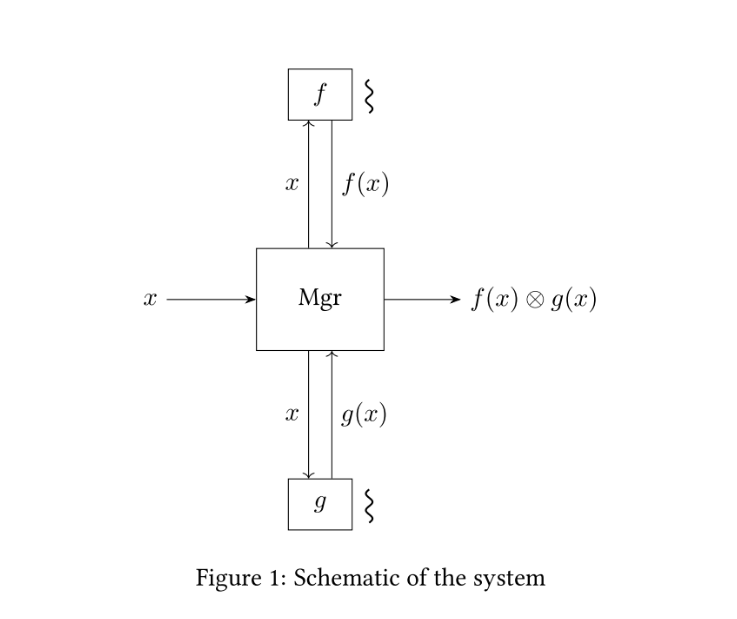

# Lab 1: Communication between tasks

## Content

 - [General description](#general-description)
 - [Logic](#logic)
 - [Computations of f and g](#computations-of-f-and-g)
 - [**My variant**](#my-variant)
 - [**Implementation**](#implementation)
 - [Literature](#literature)

## General description
The aim of this lab is to correctly organize computation using multiple processes or threads (scheduling entities). 
Solution should compute expression f(x)⊗g(x), where is a binary operation, integer value x is scanned from the input, 
computations ƒ and g are parameters and specified independently. 
The schematic of the system is given in figure 1. 
The major requirement of the exercise is that computations ƒ and g should run in parallel to main component, manager. 
Manager initializes computation process (effectively starting ƒ and g for the scanned x), 
computes the final result and organizes cancellation. 
Depending on variant manager can be single- or multithreaded. 
Multithreaded manager can summarize the result in the main thread (centralized approach) or any manager's thread is 
allowed to finalize the expression evaluation. 
Which approach must be used is also stated in the variant. 
Manager should make no assumptions about computational specifics of ƒ and g. 
But it is assumed that function result could be undefined for some inputs. 
System should make allowance for this (see Cancellation subsection). 
In some cases knowing the return of single computation (either f or g) could be enough to provide final result of the 
whole computation. 
The reason for this is failure of individual computation. 
See particulars in further description and variant formulation.



## Logic
The application should compute the value of the expression unless computation is canceled.

### Computations f and g
For a given input col with one of following results:
 - value (best-case scenario);
 - soft fail - obtaining value is still possible;
 - hard fail (worst-case scenario) - function always fails for given input.

**The way I handle it:** 
corresponding computation is restarted after soft fail, this continues until value is obtained or maximum amount of 
attempts is reached with the result of corresponding computation considered a failure.

As usual function may return no result at all.

### Cancellation
It is done by hard reset with the Q key.

### Expression value
If computations f and g return value then expression value is the result of binary operation over this two values. 
If either of computation fails then expression value is fail. 
Otherwise, expression value is undetermined.

### Output
All the output should be done by the manager component.

System **must**:
 - print the value of expression if it is computed;
 - report the failure of computation and the reason of it if one of computations failed: which function failed, hard or soft;
 - report that computation was canceled and inform why computation could not be completed: which function did not finish, number of attempts to compute if it was soft failing.

Result should be reported as soon as possible for one exception.

### Periodic cancellation
If the periodic cancellation is implemented then computation output must **not intervene** in user prompt, 
i.e. all updates should be delivered to user once he or she chooses an option for continuation/cancellation.
Result **must** be printed even if user chooses cancel but the result can be computed immediately.

### Repetition
It should be possible to consequently repeat computation multiple times for different input.

## Computations of f and g
There is an external component with sample trial functions that specifies necessary interfaces. 
Make sure to check that your system successfully integrates with external library before submitting your solution. 
Details depend on the implementation language and operation used.

### Instructions for Java:
Jar file `lab1.jar` provides packages `os.lab1.compfuncs.basic` and `os.lab1.compfuncs.advanced` (according to failure handling). 
Both contain several classes corresponding to binary operations: `DoubleOps`, `IntOps`, `Conjunction` and `Disjunction`. 
Each class provides two static functions `trialF`, `trialG` to be used during demonstration.

### Sample code:
For basic failure behavior:
```
import os.lab1.compfuncs.basic.DoubleOps;
// ...
Optional<Double> result = DoubleOps.trialF(x);
```

For advanced failure behavior:
```
import os.lab1.compfuncs.advanced.DoubleOps;
// ...
Optional<Optional<Double>> result = DoubleOps.trialF(x);
if (!result.ifPresent()) {
    // soft fail
    // ...
}
```

Add `lab1.jar` to your `classpath` when you compile and run your system.

## My variant
Use Kotlin, monitors, coroutines and attributes to store the result of the function.
Binary operation - concatenation of two strings.

## Implementation

### Computation results of f and g
The computations of the functions f and g is represented by the [Worker](src/main/kotlin/worker/Worker.kt) interface.
The [Worker](src/main/kotlin/worker/Worker.kt) return the result of its computations in form of the 
[WorkerResult](src/main/kotlin/worker/WorkerResult.kt) sealed class.

Each execution of the [Worker](src/main/kotlin/worker/Worker.kt) class' method is directed by the 
[WorkerController](src/main/kotlin/manager/controller/WorkerController.kt).
In case of the soft fail the [WorkerController](src/main/kotlin/manager/controller/WorkerController.kt) try to compute
corresponding function again, but not more than 3 times.
The [WorkerController](src/main/kotlin/manager/controller/WorkerController.kt) returns the result form of the
[ControllerResult](src/main/kotlin/manager/controller/ControllerResult.kt) sealed class.

### Cancellation
You can stop the execution of the program by pressing the Q key at any time during the functions' computation.
To implement this the [System Hook](https://github.com/kristian/system-hook) library was used.
Then, you will be asked whether you want to start again with a different input parameter.

### Expression value
For handling the correct expression value to return from the function I am using the 
[FSM](https://en.wikipedia.org/wiki/Finite-state_machine) approach.
This logic is implemented in the [FSM](src/main/kotlin/manager/FSM.kt) class.
To prevent state modification simultaneously from different threads I used the kotlin 
[Mutex](https://kotlinlang.org/docs/shared-mutable-state-and-concurrency.html#mutual-exclusion) approach.

### Repetition
After the manager finishes working you will be asked whether you want to start again with a different input parameter.
If you want to proceed, you have to responce with "y" answer. All other inputs will be considered as the refuse.

## Literature
There is the list of sources I have used during my work.

### Articles
- [How to pause a coroutine](https://medium.com/mobilepeople/how-to-pause-a-coroutine-31cbd4cf7815)
- [Futures, cancellation and coroutines](https://elizarov.medium.com/futures-cancellation-and-coroutines-b5ce9c3ede3a)
- [Exceptions in coroutines](https://medium.com/androiddevelopers/exceptions-in-coroutines-ce8da1ec060c)
- [Mutex and Monitor](https://javarush.ru/quests/lectures/questmultithreading.level06.lecture06)
- [Optional: Schrodinger's cat in Java 8](https://habr.com/ru/post/346782/)
- [Kotlin Coroutine Job Lifecycle](https://marco-cattaneo.medium.com/kotlin-coroutine-job-lifecycle-c1166039d906)
- [Guide to the Volatile Keyword in Java](https://www.baeldung.com/java-volatile)
- [Guide to java.util.concurrent.Future](https://www.baeldung.com/java-future)

### Kotlin docs
- [Run non-cancellable block](https://kotlinlang.org/docs/cancellation-and-timeouts.html#run-non-cancellable-block)
- [Mutual exclusion](https://kotlinlang.org/docs/shared-mutable-state-and-concurrency.html#mutual-exclusion)
- [Structured concurrency with async](https://kotlinlang.org/docs/composing-suspending-functions.html#structured-concurrency-with-async)
- [Timeout](https://kotlinlang.org/docs/cancellation-and-timeouts.html#timeout)
- [TimeoutCancellationException](https://kotlinlang.org/api/kotlinx.coroutines/kotlinx-coroutines-core/kotlinx.coroutines/-timeout-cancellation-exception/)
- [Cancellation and exceptions](https://kotlinlang.org/docs/exception-handling.html#cancellation-and-exceptions)
- [CoroutineScope](https://kotlinlang.org/api/kotlinx.coroutines/kotlinx-coroutines-core/kotlinx.coroutines/-coroutine-scope/)
- [Coroutine context and dispatchers](https://kotlinlang.org/docs/coroutine-context-and-dispatchers.html)
- [ExecutorCoroutineDispatcher](https://kotlinlang.org/api/kotlinx.coroutines/kotlinx-coroutines-core/kotlinx.coroutines/-executor-coroutine-dispatcher/)

### YouTube
[Course on coroutines](https://youtube.com/playlist?list=PL0SwNXKJbuNmsKQW9mtTSxNn00oJlYOLA):
- [#4 Handling errors in coroutines](https://youtu.be/e-AG26XPtHc)
- [#6 Synchronization between coroutines](https://youtu.be/OqoAXLXGBtY)

### StackOverflow
- [Catch Exception and prevent it from propogating to parent scope in Kotlin Coroutines](https://stackoverflow.com/questions/70673885/catch-exception-and-prevent-it-from-propogating-to-parent-scope-in-kotlin-corout)
- [kotlin coroutine withTimeout does not cancel when using withContext to get non-blocking code](https://stackoverflow.com/questions/56305044/kotlin-coroutine-withtimeout-does-not-cancel-when-using-withcontext-to-get-non-b)
- [What's a monitor in Java?](https://stackoverflow.com/questions/3362303/whats-a-monitor-in-java)
- [Correct way of locking a mutex in Kotlin](https://stackoverflow.com/questions/67321436/correct-way-of-locking-a-mutex-in-kotlin)
- [How to get the name of a coroutine in Kotlin?](https://stackoverflow.com/questions/54319799/how-to-get-the-name-of-a-coroutine-in-kotlin)
- [Difference between ExecutorCoroutineDispatcher and CoroutineDispatcher](https://stackoverflow.com/questions/58854731/difference-between-executorcoroutinedispatcher-and-coroutinedispatcher)
- [coroutine callback when running job is longer than 10 seconds](https://stackoverflow.com/questions/65605639/coroutine-callback-when-running-job-is-longer-than-10-seconds)